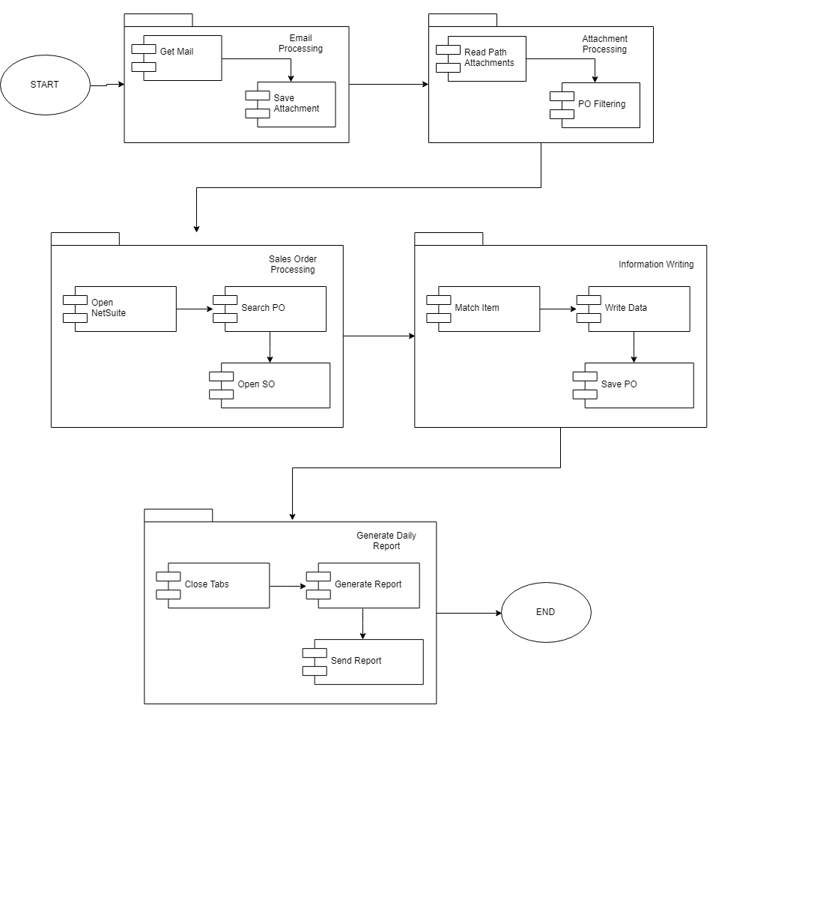

# Vendor Process Solution
## Inputs
many inputs

## Description

This process reads the email using Outlook 365, filters the current day email of daily billing and/or open order from AVT, downloads and opens the attached file. Then the bot reads each PO number from the file and updates the SO page with the read information. At the end of the process a status report is sent to the process owner. 

---
## Getting Started

These instructions will get you a copy of the project up and running on your local machine for development and testing purposes. See deployment for notes on how to deploy the project on a live system.

---
### Prerequisites

Make sure you have installed all of the following prerequisites on your deveolpment machine:

- Git - [Download & Install Git](https://git-scm.com/downloads). OSX and Linux machines typically have this already installed.
- UiPath - [Download & Install](https://www.uipath.com)
---

## Objectives 

The process has been selected for RPA by RoundTower Technologies as part of a larger initiative for internal implementation and re-reselling of RPA projects. The aim of this process automation is linked to the project business case and it is mainly intended to:

- 	Deliver faster processing
-	Reduce redundant activities
-	Improve overall performance and reliability

---

## Initial conditions 

The process starts with the next list of initial conditions, otherwise the bot won't process transactions:
- The bot's  schedule is daily at 9:00 AM.
- An email comes to the inbox of the mail example@example.com with the subject "Daily report".

---

## Applications  

This list of applications is:
- Internet Explorer	11.765.17134.0
- Outlook	Outlook for Office 365 MSO version 1902
- Excel	Excel for Office 365 MSO version 1902
- NetSuite	2019.1

---

## Folder structure

The folder structure is divided by stages where each one is represented with the big square that contains the stages with the correspond name. 

Is important to mention that each stage is tested separately according to the test aceptance criteria (TAC).




---

## Folder description

In this section is presented the detailed folder structure where all folders with a number and a point on the beginning represents a stage of the process


```

|-- vendorprocess
    |-- Main.xaml
    |-- Properties-P.json
    |-- Properties-Q.json
    |-- README.md
    |-- START-P.xaml
    |-- START-Q.xaml
    |-- 1.Email_Processing
    |   |-- 1.1.Get_Mail.xaml
    |   |-- 1.2.Save_attachments.xaml
    |   |-- README.md
    |-- 2.Attachment_Processing
    |   |-- 2.1.Read_Path_Attachments.xaml
    |   |-- 2.2.PO_Filtering.xaml
    |   |-- README.md
    |-- 3.Sales_Order_Processing
    |   |-- 3.1.Open_NetSuite.xaml
    |   |-- 3.2.Search_PO.xaml
    |   |-- 3.3.Open_SO.xaml
    |   |-- README.md
    |-- 4.Information_Writing
    |   |-- 4.1.WaitPageLoad.xaml
    |   |-- 4.2.SelectAll.xaml
    |   |-- 4.3.ExtractTable.xaml
    |   |-- 4.4.Write_Information.xaml
    |   |-- README.md
    |-- 5.Generate_Daily_Report
    |   |-- 5.1.Close_Tabs.xaml
    |   |-- 5.2.Generate_Report.xaml
    |   |-- 5.3.Send_Report.xaml
    |   |-- README.md
    |-- artefacts
    |   |-- Folders.png
    |-- input
    |-- output
    |   |-- Error_Report.csv
    |   |-- Metrics.txt
    |-- temp
|       |-- process.json

```


This structure is created by the next command
```
mddir ~/Documents/process folder
```

---
## Outputs 
When the bot finishes the process, the output visible for the process owner, will be the next list:

- Error_Report.csv
- Metrics.txt

---
## Process messages 

In this section are presented the templates that are going to be sent by the bot, in this case are two types of mails that are showed in the next table. Each one will have a screenshot and the excel document attached.

### Successfull Process

<table>
  <tr>
    <th>Email type</th>
    <th>Error Handle</th>
    <th>Successful Process</th>
  </tr>
  <tr>
    <td><span style="font-weight:700">Email structure</span></td>
    <td>To: &lt;Reminder&gt;<br>CC: user@user.com<br>Subject: &lt;ticket number&gt;<br>Body: <br>Dear agent. <br>&lt;Notification error argument&gt; <br>Greetings.<br><br>Vendor process bot</td>
    <td>To: &lt;Reminder&gt;<br>CC: user@user.com<br>Subject: &lt;ticket number&gt;<br>Body: <br>Dear agent. <br>Your ticket &lt;number&gt; is ready, find it attached for your revision. <br>Greetings.<br><br>Vendor process bot</td>
  </tr>
</table>

---
## About

This bot was developed by Digital Americas Pipeline Iniciative

Ruta N - Calle 67 Nº 52-20, Medellin - Colombia

(4) 5167770 ext 1091
